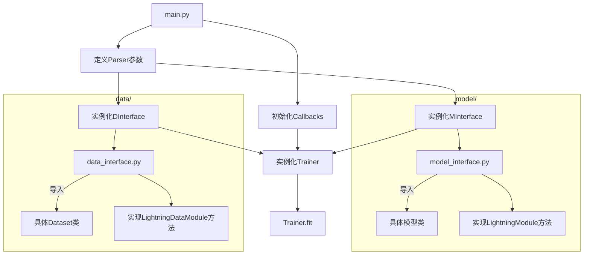

## 前言
在曾经的训练任务中我们倾向于一种传统的代码结构：数据流结构。这是一套很合乎情理的流程，遵循了机器学习所需要的操作的时间顺序。然而在作者的一次机器学习模版的设计过程中，发现了数据流设计的一个弊端：不易套用。如果说是简单的进行训练那还好说，一旦要让模版能够被各种模型和数据集套用，数据流结构就显得及其冗杂。因为要遵循时间顺序，所以前后一定有所关联，这就让接口显得很复杂。简单尝试后作者就选择了放弃，虽然项目的完成度在上升，但是接口已经越来越复杂了。

现在问题来了，随着做的项目开始出现了一些稍微高阶的要求，会发现我们总是不断地在相似工程代码上花费大量时间，Debug也是这些代码花的时间最多，而且渐渐产生了一个矛盾之处：如果想要更多更好的功能，如TensorBoard支持，Early Stop，LR Scheduler，分布式训练，快速测试等，代码就无可避免地变得越来越长，看起来也越来越乱，同时核心的训练逻辑也渐渐被这些工程代码盖过。

所以就有了 Pytorch Lightning（后文简称PL）。PL最大的特征是抽象化的系统设计。它的好处是可复用性强，易维护，逻辑清晰等。缺点也很明显，这个包需要学习和理解的内容比较多，而且需要你抛开数据流的思路，重新看待代码的设计。这不会影响训练的形式，但是仍然需要去适应。

## 使用

